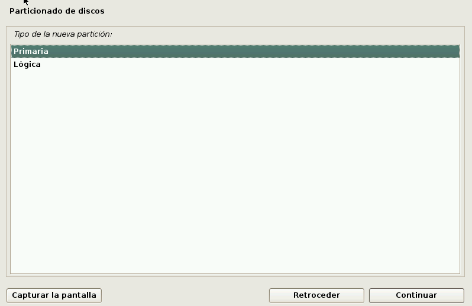
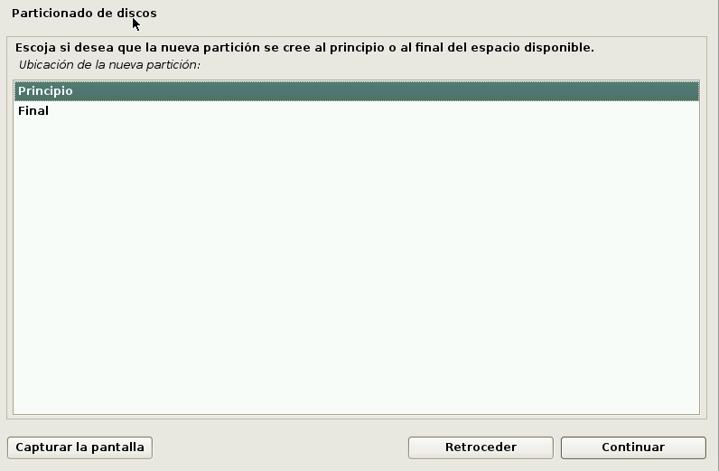
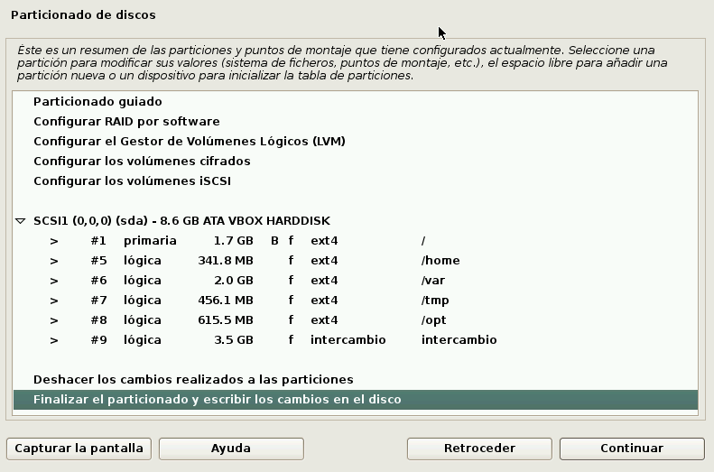
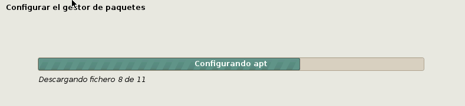
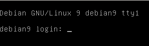

Como instalar debian 9 desde cero para un server
=====================================

Lo primero que nos mostrará será un menú que nos indica como queremos realizar la instalación. En este caso elegiremos la gráfica, mediante la opción "Graphical Install"

Luego elegiremos el idioma con que queremos que se realice la instalación, en nuestro caso español:

Seguidamente nuestra ubicación para que se defina la zona horaria:

.. image:: ../imagenes/Instalacion_Debian_9/015.png

Se configura el teclado dependiendo del tipo que tengamos:

Se empiezan a cargar componentes:

Le damos el nombre a nuestro servidor:

Le damos el nombre del dominio:

Le asignamos la contraseña al usuario root:

Luego se crea una cuenta de usuario alternativa a la de root, para ser usada en tareas que no sean administrativas. Se coloca el nombre completo para el usuario:

Se asigna el nombre de usuario para la cuenta:

Se le asigna la contraseña a la nueva cuenta:

Se empiezan a cargar nuevas configuraciones, incluida la configuración del reloj:

Pasamos a la parte de particionado de discos, en este caso elegimos manual para entener bien como se realiza dicho particionado:

Seleccionamos el disco que tenemos:

Luego nos preguntará si queremos crear una tabla de particiones vacía en este dispositivo, y le decimos que sí. Si llegara a haber otras particiones ya configuradas, serán eliminadas:

Seleccionamos todo el espacio libre:

Creamos una partición nueva:

En los server debemos respetar la premisa de que la partición var sea la que tenga mayor espacio, y la swap dependerá de la ram. Sí la ram está entre 1 y 2 GB, la swap sera 1,5 veces la ram; y si esta entre 2 a 8 GB, la memoria de intercambio debe ser igual a la ram. Es recomendable asignar los espacios, antes de empezar el particionado.

Asignamos el espacio que le daremos a la partición. Este puede ser especificado en número o en porcentaje:

Como es la partición / la que estamos creando le decimos que sea primaria:

Le decimos que la nueva partición se cree al principio:

.. image:: ../imagenes/Instalacion_Debian_9/032.png

Le colocamos la marca de arranque activada:

Y le decimos que se ha terminado de definir la partición:

Volvemos a seleccionar el espacio libre:

Creamos otra partición que en este caso será para /home:

Le asignamos la cantidad que queremos que ocupe del disco. Como es un server, /home no debe tener tanto espacio, a diferencia de cuando se realiza la instalación para un desktop:

Le decimos que sea una partición lógica:

Que la partición se cree al principio:

Y luego le damos a la opción de se ha terminado de definir la partición:

Y así crearemos todas las particiones que necesitemos y el área de intercambio:

Creamos la partición para la swap:

le asignamos el espacio:

.. image:: ../imagenes/Instalacion_Debian_9/061.png

Le decimos que sea lógica:

En la opción utilizar como, le decimos que sea área de intercambio:

Y así finalmente queda nuestro particionado:

Seleccionamos la opción de finalizar el particionado y escribir los cambios en el disco:

Le decimos que sí a la pregunta de si deseamos escribir los cambios en los discos:

Luego nos pregunta que si deseamos analizar otro cd o dvd. En nuestro caso no, ya que estamos instalando una sola ISO:

Seguidamente nos pregunta si deseamos utilizar una réplica de red. Le decimos que no, ya que queremos instalar solo los paquetes que contiene la ISO:

Se cargan configuraciones del gestor de paquetes, incluidas las de apt:

Luego nos pregunta si queremos participar en una encuesta sobre el uso de paquetes, y en nuestro caso le decimos que no:

Seleccionamos los programas a instalar. En este caso unicamente las utilidades estandar del sistema, ya que luego instalaremos lo que necesitemos a traves de los repositorios de Debian:

Comienza la instalación de los programas seleccionados:

Luego nos pregunta si deseamos instalar el cargador de arranque GRUB y le decimos que sí:

Seleccionamos el disco a donde será instalado:

Se instalar el cargador de arranque GRUB:

.. image:: ../imagenes/Instalacion_Debian_9/078.png

¡FELICITACIONES! has instalado debian 9 de manera satisfactoria:

Finalmente te solicitará el login para poder acceder al servidor:

